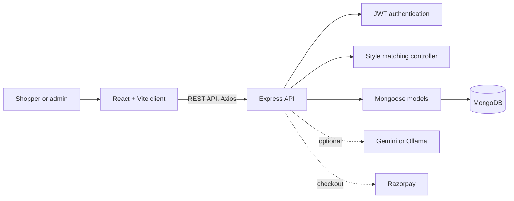
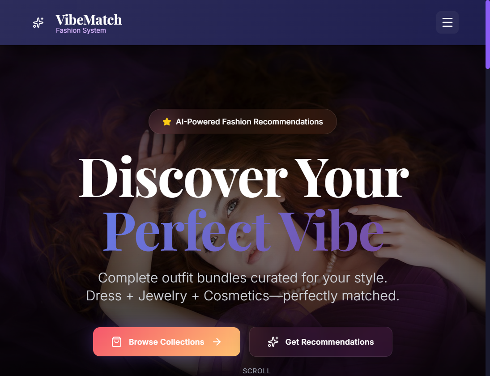
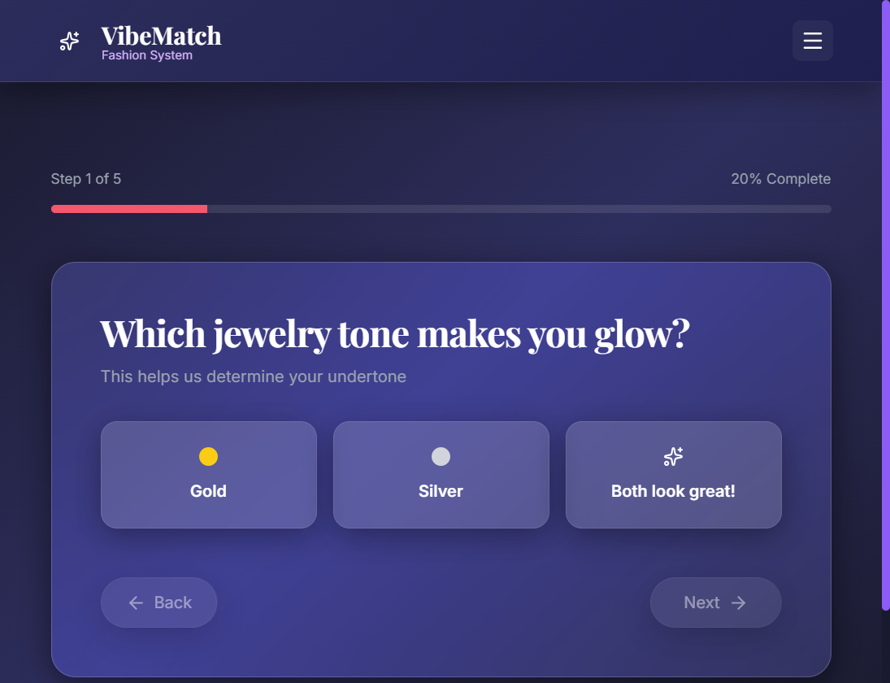
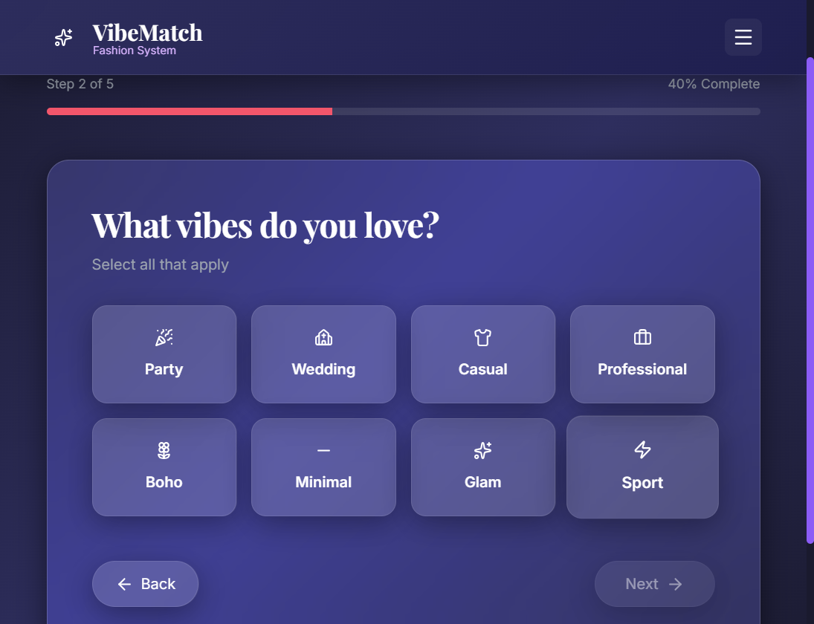
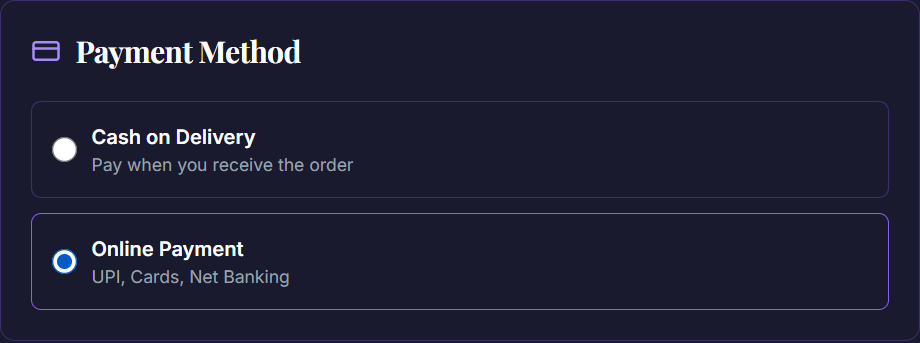

# VibeMatch

## Overview

VibeMatch is a MERN-based fashion discovery and shopping app. A five-step style quiz collects preferences, then a rules-based recommendation engine matches clothing, accessories, and cosmetics into coordinated looks. The app also includes shopping, account, and administration workflows.

## Key Features

- Five-step style quiz for jewelry tone, favorite vibes, silhouettes, seasonal palette, and size
- Outfit recommendations matched by vibe, silhouette, undertone, seasonal palette, and compatibility tags
- Product browsing, search, favorites, cart, checkout, and order tracking
- Virtual outfit preview and optional AI-assisted styling integrations
- Admin dashboard for products, orders, users, and analytics
- Razorpay checkout integration with payment-signature verification and optional dummy mode

## Technology Stack

- Frontend: React 18, Vite, Tailwind CSS, React Router, Zustand, Framer Motion
- Backend: Node.js, Express, MongoDB, Mongoose
- Authentication and payments: JWT, bcrypt, Razorpay
- Data fetching and visualization: Axios, Recharts
- Optional AI integrations: Gemini and Ollama

## System Architecture

The client communicates with the Express REST API. Route handlers use Mongoose models for persistence; JWT middleware protects account, order, and admin operations. The matching controller queries products using the style profile, while AI and payment providers are optional integrations configured on the server.



The recommendation flow is deterministic and rules-based:

1. The quiz maps jewelry preference to an undertone and records vibe, silhouette, season, and size preferences.
2. The matching endpoint selects active dresses for the chosen vibe and, when provided, the preferred silhouette.
3. For each dress, it looks for accessories with compatible tags and cosmetics that match the selected undertone and vibe.
4. It combines the best available matches into looks, applies a 10% bundle discount, and sorts results by a compatibility score based on shared seasons, undertone, and tags.

Optional AI styling integrations are separate from the core matching flow.

## Screenshots






## Project Structure

```text
client/                 React application, pages, components, and static assets
server/
  controllers/           Recommendation and admin logic
  middleware/            JWT authentication middleware
  models/                Mongoose schemas
  routes/                REST API endpoints, including checkout
  services/              Optional AI integrations
  server.js              Express entry point
docs/screenshots/        Application screenshots
.env.example             Placeholder environment-variable template
package.json             Backend and development scripts
```

## Installation

Prerequisites: Node.js 18 or newer and a MongoDB instance. A local MongoDB server or MongoDB Atlas database can be used.

Install the server and client dependencies from the repository root:

```powershell
npm install
npm --prefix client install
Copy-Item .env.example .env
```

On macOS or Linux, use `cp .env.example .env` instead of `Copy-Item`.

## Environment Variables

Edit the local `.env` file. `.env.example` contains placeholders only; never commit `.env` or put real credentials in source code or screenshots.

| Variable | Purpose |
| --- | --- |
| `MONGODB_URI` | MongoDB connection string |
| `JWT_SECRET` | Long, unique secret used to sign authentication tokens |
| `PORT` | API port (defaults to `5000`) |
| `CLIENT_URL` | Client origin allowed by CORS (defaults to `http://localhost:5173`) |
| `RAZORPAY` | Set to `enable` only when configuring online payments |
| `RAZORPAY_KEY_ID`, `RAZORPAY_KEY_SECRET` | Razorpay credentials; use test keys for development |
| `RAZORPAY_DUMMY` | Optional dummy payment mode for local testing |
| `AI`, `AI_API_KEY`, `AI_OLLAMA`, `AI_OLLAMA_MODEL` | Optional AI service configuration |
| `GEMINI_API_KEY`, `GEMINI_MODEL` | Optional Gemini configuration |
| `NODE_ENV` | Runtime environment |

Keep integrations disabled unless configured. If a credential is ever exposed, revoke or rotate it with the provider.

## Running the Application

After setting `MONGODB_URI` and a strong, unique `JWT_SECRET`, start both the API and frontend:

```sh
npm run dev
```

The client runs at `http://localhost:5173`; the API runs at `http://localhost:5000`. Build the client with:

```sh
npm run build
```

## What I Learned

I implemented a full-stack flow that connects a preference quiz to product recommendations and shopping features. This project helped me learn how to:

- Model users, products, and orders with Mongoose and expose them through Express APIs.
- Keep client state in sync with authenticated API requests using Zustand and JWT.
- Build a transparent recommendation approach using product attributes, compatibility rules, and scoring.
- Verify Razorpay payment signatures on the server before creating an order.
- Organize optional AI integrations and external services behind server-side configuration.